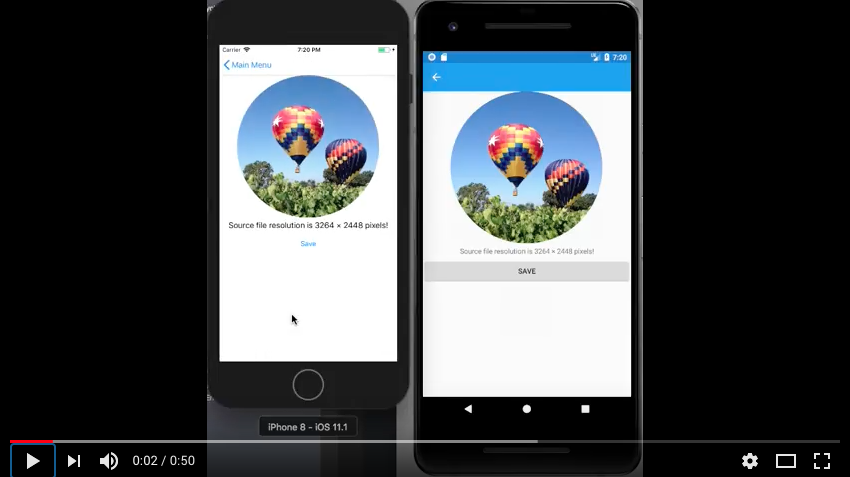

##  ImageCropView for Xamarin.Forms [](https://www.paypal.com/cgi-bin/webscr?cmd=_s-xclick&hosted_button_id=VPZ4KHKHXXHR2 "Donate to this project using Paypal")

Image cropper for Xamarin.Forms.

NuGet: https://www.nuget.org/packages/DLToolkit.Forms.Controls.ImageCropView/

Video:

[](https://youtu.be/WEVJ4Sd3go0)

## Features: 
- Pan & pinch gestures
- Custom border view support
- FFImageLoading transformations support (like CircleTransformation, etc)
- **All** Xamarin.Forms platforms supported

## Important

- It relies on FFImageLoading, so be sure to configure it properly
 - Add nuget to all projects (shared & platform specific)
 - `CachedImageRenderer.Init()` in you platform specific project. 
 - `var ignore = typeof(CropTransformation)` in you platform specific project if you have linking issues in release builds.
 - More here: https://github.com/luberda-molinet/FFImageLoading/wiki

## Simple Example:

### Sample

```XML
<imgcrop:ImageCropView HeightRequest="300" WidthRequest="300" x:Name="cropView"
    Source="http://photos2.insidercdn.com/iphone4scamera-111004-full.JPG">
    <imgcrop:ImageCropView.PreviewTransformations>
        <fftransformations:CircleTransformation />
    </imgcrop:ImageCropView.PreviewTransformations>
</imgcrop:ImageCropView>
```

```C#
var result = await cropView.GetImageAsJpegAsync(quality=90, maxWidth=600);
```


For other examples see sample app: [ImageCropView Examples](https://github.com/daniel-luberda/DLToolkit.Forms.Controls/tree/master/Samples/DLToolkitControlsSamples/SamplesImageCropView) *(TIP: Clone repo, open the solution, build it and run sample app.)*

## FAQ

#### TODO